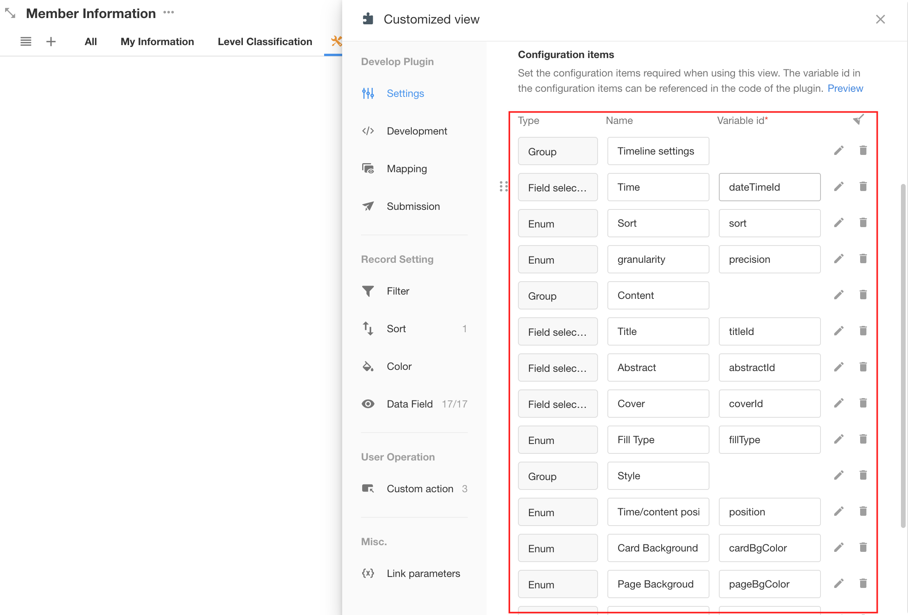

# HAP View Plugin Samples

| Plugin Name | Source Code                                                                                                                          |
| -------- | ------------------------------------------------------------------------------------------------------------------------------------------------ |
| Map    | [https://github.com/nocoly/plugin_view_samples/tree/main/map](https://github.com/nocoly/plugin_view_samples/tree/main/map)           |
| Detail Table   | [https://github.com/nocoly/plugin_view_samples/tree/main/table](https://github.com/nocoly/plugin_view_samples/tree/main/table)       |
| Timeline   | [https://github.com/nocoly/plugin_view_samples/tree/main/timeline](https://github.com/nocoly/plugin_view_samples/tree/main/timeline) |

## How to develop a plugin

Please be sure to read the following documentation to understand the basic process of plugin development, as well as the environment software and tools required to install the development plugin. 

[HAP - View Plugin Develop Documentation](https://help.nocoly.com/extensions/developer/view)

## How to install existing plugins into an organization

Taking the "Timeline" in this repository as an example, let's install this view plugin into the existing application of HAP.

### 1.Clone repository to local

Open the console and clone the repository to the local: 

```shell
git clone https://github.com/nocoly/plugin_view_samples.git
```

### 2.install dependencies

Go to the `Timeline` folder and execute the following command to install the project dependencies:

```shell
cd plugin_view_samples/timeline
npm i
```

### 3. Get the plugin view ID in the app

Create a "plugin view" in the HAP application and get the plugin view ID, Template, and Host.


As shown in the figure above, the ID information for this plugin view is as follows:

```
id: 6724424cb9048693bafe0df5-67355eef5c3ad0afc5ca937d
template: React
host: https://www.nocoly.com/wwwapi/
webui: https://www.nocoly.com/
```

### 4. Modify `mdye.json` and link to the HAP view plugin

In the IDE, replace the`id`, `host`, and `webui` in the `mdye.json` file with the information obtained above.


### 5. Synchronized view parameter configuration

The local project has been associated with the view in the HAP application. You can then use the following command to synchronize the plugin parameter configuration to the HAP application:

```shell
mdye sync-params
```


After refreshing the page in the HAP application, the synchronized parameter items can be viewed in the plug-in view configuration:




### 6. Running and debugging plugins

Start the local development service in the local project.

```shell
mdye start
```


Copy the URL address in the screen to "Debugging" in the "Development" configuration of the view plugin and click "Load".


### 7. Config the configuration mapping

Open the plugin view configuration in the HAP application, click "Mapping", complete the view configuration, and immediately preview the page effect after the plugin takes effect in the view:


### 8. Submit and publish plugins

For submitting view plugin code and publishing plugins to HAP for organization-wide availability, refer to the relevant section in [HAP - View Plugin Develop Documentation](https://help.nocoly.com/extensions/developer/view).